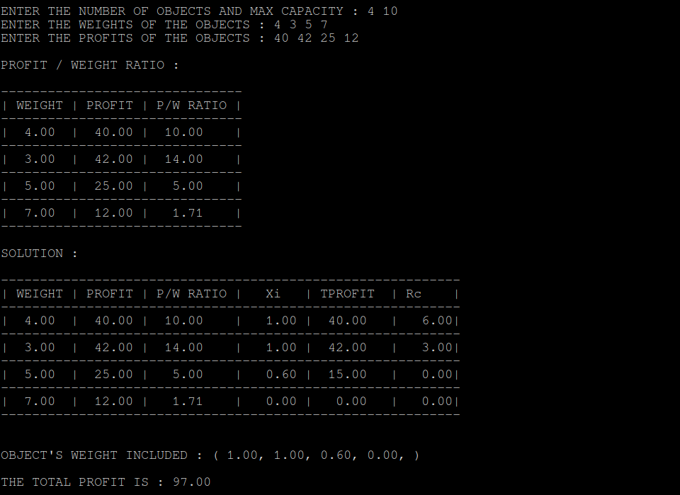
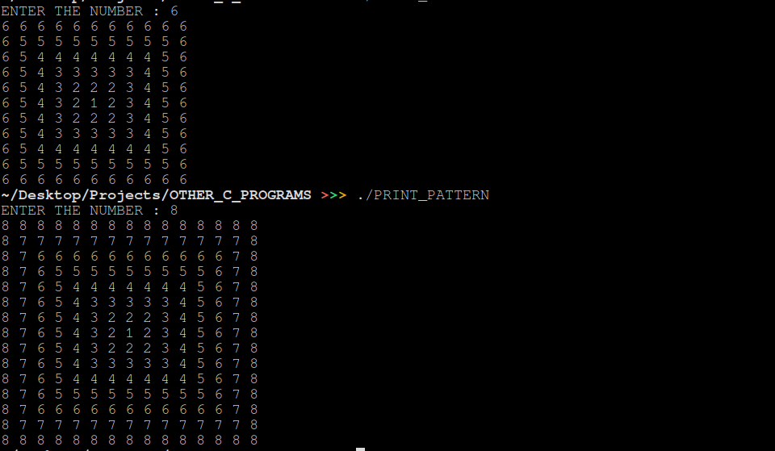
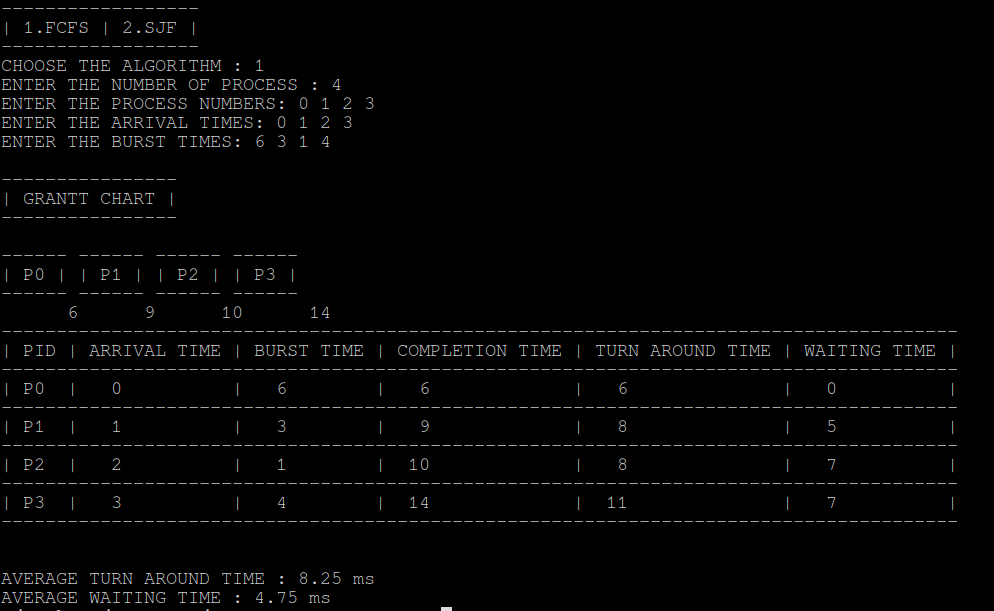
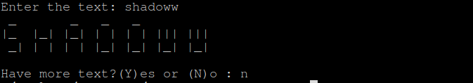

# C PROGRAMS

Some random **C Programs**.

## KNAPSACK'S PROBLEM :

C Program for Knapsack's Problem.

## PRINT PATTERN :

C Program to print pattern.

## SCHEDULING ALGORITHMS :

C Program for Scheduling Algorithms.Such as `FCFS`, `SJF`, `SRTF` etc.

## ASCII TEXT GENERATOR :

C Program for ASCII Text genaration.

